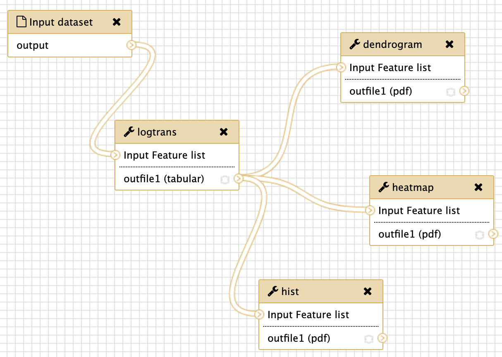

# Biobyte
Training example for Biobyte training event.

## Example data
Example data is available as MTBLS00.
From the example data, peak picking was performed with XCMS and standard settings to give the feature list.

## Galaxy workflow
Below is a screenshot of the full Galaxy workflow which includes data import, log-transformation, and modules for plotting a heatmap, dendrogram and histogram.

## Processing of the workflow
Processing the feature list (in tabular format) in the Galaxy workflow management system results in the following plots.

## Acknowlegements
- Kristian Peters
- Hendrik Treutler
- Rene Meier
- Steffen Neumann

