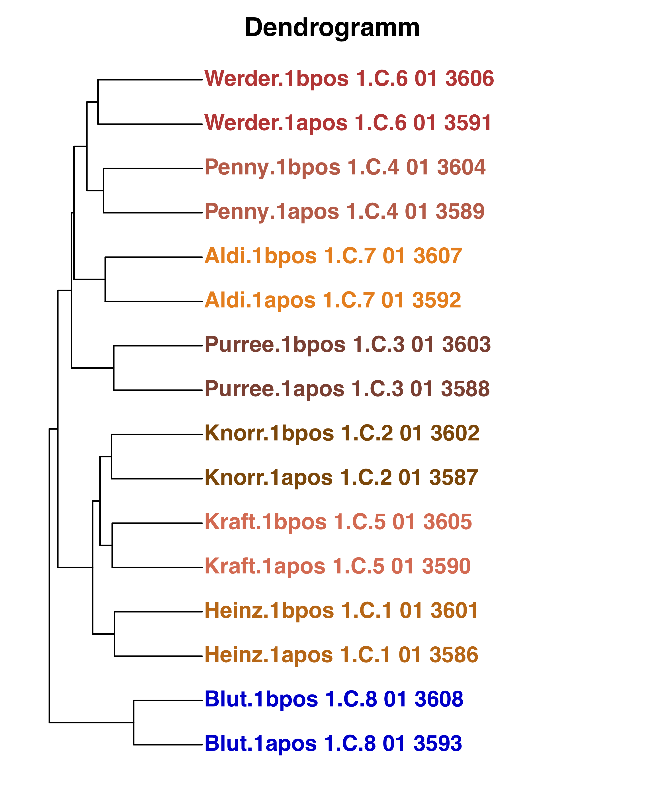
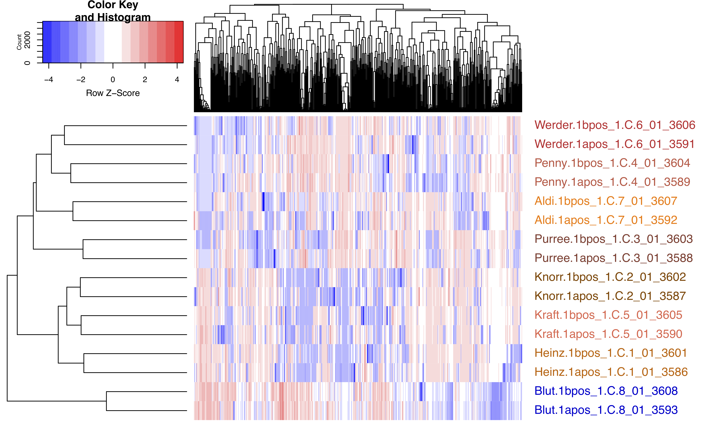

# Biobyte
Training example for Biobyte training event.

## Example data
Example data is available as MTBLS655 (Metabolite Profiling: Blood or Ketchup).
From the example data, peak picking was performed with XCMS and standard settings to give the feature list.

The example feature list can be imported from this url: `https://ogy.de/lsep`

## Galaxy workflow
Below is a screenshot of the full Galaxy workflow which includes data import, log-transformation, and modules for plotting a heatmap, dendrogram and histogram.

The example workflow for training can be imported from this url: `https://ogy.de/w6zr`

## Processing of the workflow
Processing the feature list (in tabular format) in the Galaxy workflow management system results in the following plots.

## Acknowlegements
- Kristian Peters
- Hendrik Treutler
- Rene Meier
- Steffen Neumann
- Edda Roepenack (for the dataset on MetaboLights)

